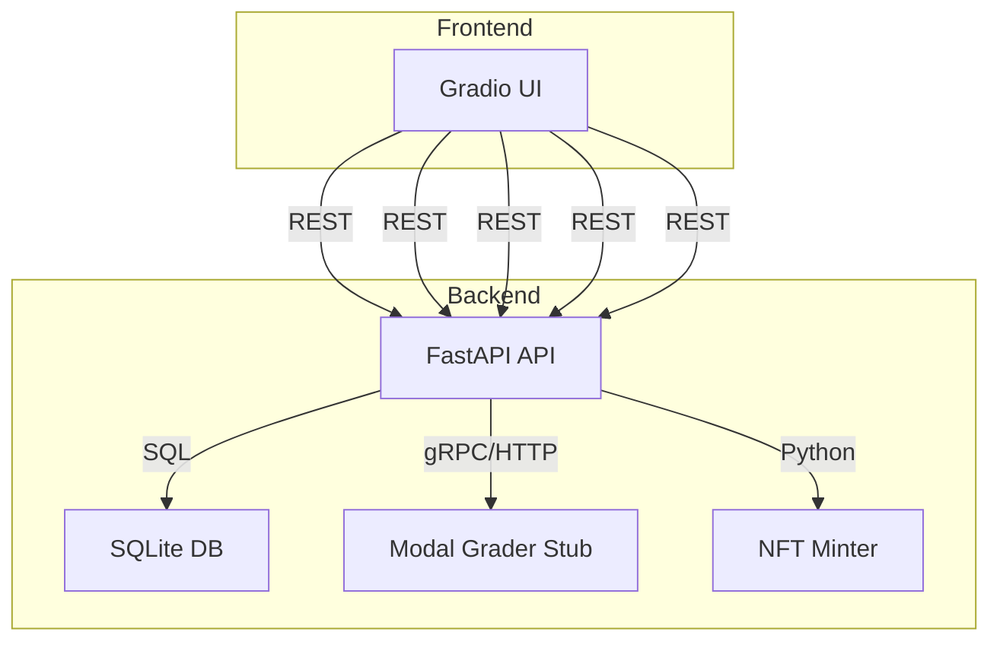

# PokéCertify Implementation Plan

## 1. Directory Structure

```
pokecertify/
├── src/
│   ├── backend/
│   │   ├── api/
│   │   │   └── main.py
│   │   ├── db/
│   │   │   ├── schema.sql
│   │   │   └── utils.py
│   │   └── modal_grader/
│   │       └── modal_grader.py
│   ├── frontend/
│   │   └── app.py
│   ├── nft/
│   │   └── nft_minter.py
│   └── shared/
│       └── config.py
├── requirements.txt
├── requirements-dev.txt
├── README.md
├── .env.example
├── scripts/
│   ├── init_db.sh
│   └── deploy_all.sh
└── deployment/
    ├── Dockerfile.backend
    ├── Dockerfile.frontend
    └── docker-compose.yml
```

---

## 2. Component Breakdown

### Backend (FastAPI)
- `src/backend/api/main.py`: FastAPI app with endpoints for upload, verify, trade.
- `src/backend/db/schema.sql`: SQLite schema for cards and trades.
- `src/backend/db/utils.py`: DB connection helpers.
- `.env.example`: For DB path, Modal API keys, etc.

### AI Grading (Modal Labs)
- `src/backend/modal_grader/modal_grader.py`: Modal Labs ResNet-50 grading stub, returns grade/confidence.

### Frontend (Gradio)
- `src/frontend/app.py`: Gradio UI with tabs for upload, verify, trade, collection, certificate.

### NFT Minting
- `src/nft/nft_minter.py`: Web3.py integration for Polygon testnet, mintNFT function.

### Shared Config
- `src/shared/config.py`: Centralized config for API URLs, DB paths, etc.

### Deployment
- `requirements.txt`: All runtime dependencies.
- `requirements-dev.txt`: Dev/test dependencies.
- `scripts/init_db.sh`: Initializes SQLite DB.
- `scripts/deploy_all.sh`: Deploys backend, frontend, Modal, NFT.
- `deployment/Dockerfile.*`: Dockerfiles for backend/frontend.
- `deployment/docker-compose.yml`: Orchestrates all services.

---

## 3. Key Implementation Steps

1. **Database**
   - Write `schema.sql` for cards/trades with constraints and indexes.
   - Provide `init_db.sh` to initialize DB.

2. **Backend**
   - Implement FastAPI endpoints: `/upload`, `/card/{card_id}`, `/trade`.
   - Integrate Modal Labs grading via async call.
   - Use parameterized queries, robust error handling, logging.

3. **AI Grading**
   - Modal Labs stub: Accepts base64 image, returns grade/confidence.
   - Handles errors (bad base64, model issues).

4. **Frontend**
   - Gradio UI: Tabs for upload, verify, trade, collection, certificate.
   - Calls backend endpoints, displays results, handles errors.
   - PDF certificate generation with QR code.

5. **NFT Minting**
   - Web3.py script: Connects to Polygon testnet, mints NFT for card.
   - Secure key handling, error reporting.

6. **Deployment**
   - Dockerfiles for backend/frontend.
   - Compose file for orchestration.
   - Scripts for DB init and full deployment.

---

## 4. Mermaid Architecture Diagram



---

## 5. Error Handling & Scalability

- All endpoints validate input, handle DB/Modal/network errors, and return clear messages.
- SQLite for MVP; PostgreSQL migration path.
- Modal Labs scales AI grading.
- Docker Compose enables multi-container scaling.

---

## 6. Edge Cases

- Duplicate card IDs, invalid images, missing fields, DB/network failures, NFT minting errors.
- All handled with clear error responses and logging.

---

## 7. Deployment Overview

- `init_db.sh`: Initializes the SQLite DB using schema.sql.
- `deploy_all.sh`: Builds and launches all services via Docker Compose.
- `.env.example`: Template for environment variables (DB path, Modal API keys, Web3 keys).
- `Dockerfile.backend` and `Dockerfile.frontend`: Containerize backend and frontend.
- `docker-compose.yml`: Orchestrates all containers for local or cloud deployment.

---

## 8. Next Steps

- Switch to code mode to begin implementation as per this plan.